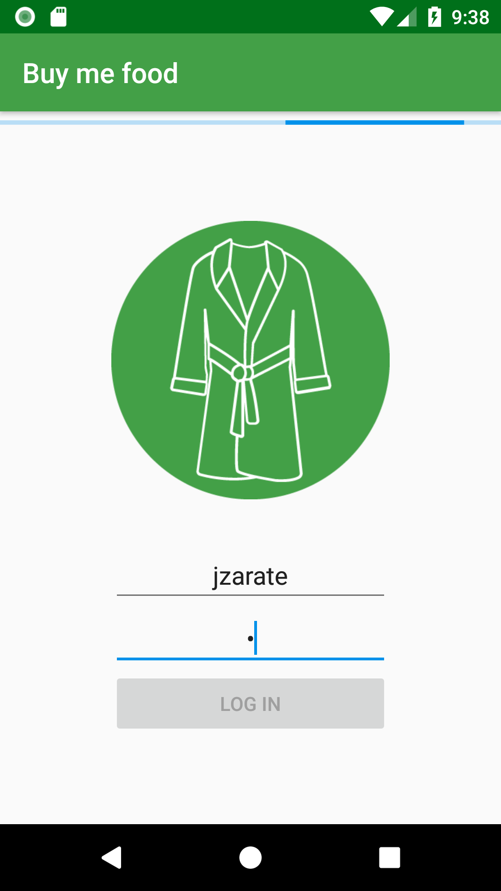
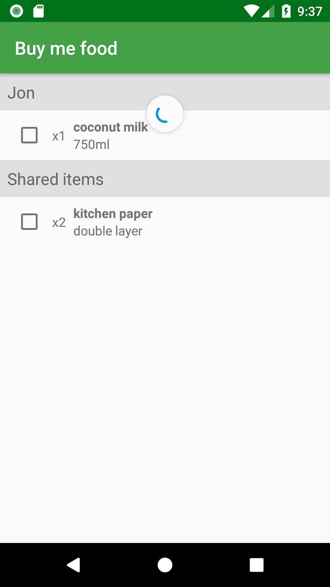

_(Work in progress - check development branch)_

# BuyMeFood 

This App is meant to be used amongst flatmates or couples living together. 

The main purpose is to have a shared shopping list, so that they can buy stuff their partners need. 

 

## Features

This is the list of features I want to implement:

* All users need to belong to a group
* Users from the same group can see other's requests
* Post an item request (with details like brands, amount, price range etc.)
* Change the item status when someone buys it (and save how much they paid)
* Keep track of owed money to each member of the group
* Subtract debt to a partner once it's been paid

## Concepts

I started this project in order to develop the following skills:

* MVP architecture + Interactors
* Screen rotation through fragment retainment
* NoSQL (Documents)
* ConstrainLayout and animations

## Database scheme

## Firestore limitations

* Operand `or` in queries is not supported 
* List contents cannot be queried, only map values
* Cannot nest lists

## Tools / Libraries

* [Firebase Firestore](https://firebase.google.com/docs/firestore/)
* [ButterKnife](https://github.com/JakeWharton/butterknife)